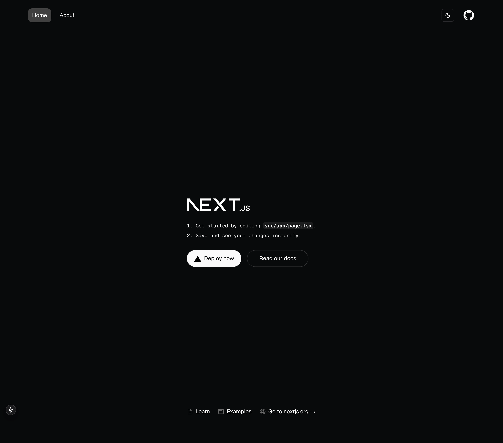
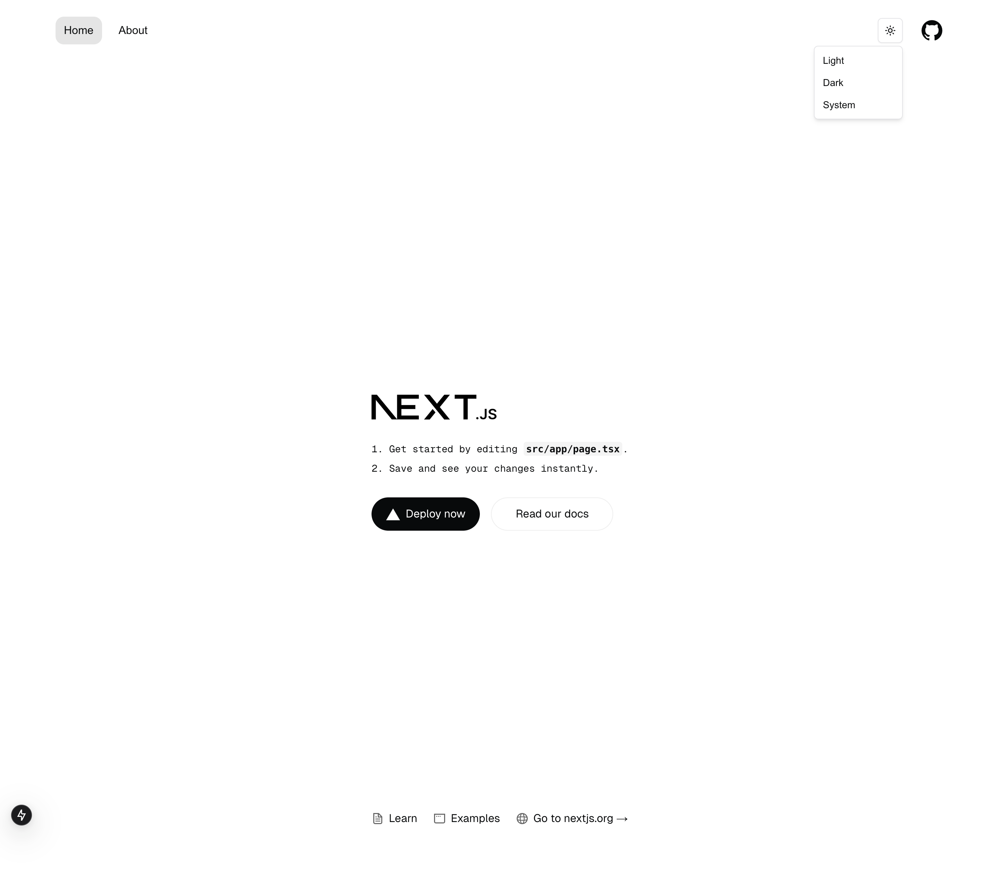

# Next.js 15 Starter (shadcn + typescript + react 19) [[See Demo](https://next-15-starter.netlify.app/)]


A modern **Next.js 15 Starter** template featuring React 19, TypeScript 5, Tailwind CSS 3, and Shadcn UI. Pre-configured with essential developer tools and optimized VS Code settings for an efficient development experience.





## 🚀 What's Included

- **Next.js 15 (Stable)**
- **React 19 (Stable)**
- **TypeScript 5**
- **ESLint 9**
- **Prettier 3**
- **Tailwind CSS 3**
- **Shadcn UI**
- **App Directory**
- **System, Light & Dark Mode**


## 🏁 Getting Started

### Prerequisites

- **Node.js**: Version 20.18.0 or higher
- **Bun**: Version 1.0.0 or higher

### Bun Setup

1. **Install Bun**:
    ```bash
    curl -fsSL https://bun.sh/install | bash
    ```

2. **Verify Installation**:
    ```bash
    bun --version
    ```

3. **Update Bun** (if needed):
    ```bash
    bun upgrade
    ```


### Installation

1. **Clone the Repository**:
    ```bash
    git clone https://github.com/devPinheiro/nextjs-15-starter.git
    cd nextjs-15-starter
    ```
  

2. **Install Dependencies**:
    ```bash
    bun install

    # or with Yarn
    yarn install
    ```

3. **Run Development Server**:
    ```bash
    bun dev

    # or with Yarn
    yarn dev
    ```

4. **Build for Production**:
    ```bash
    bun run build
    ```

    ## 🛠️ Development Features

    - **Hot Reloading**: Changes reflect instantly in development
    - **TypeScript Strict Mode**: Catch errors early with strict type checking
    - **Code Formatting**: Automated with Prettier and ESLint
    - **VS Code Integration**: Enhanced development with recommended extensions
    - **Performance Optimized**: Built-in Next.js optimizations
    - **SEO Ready**: Meta tags and OpenGraph support included

    ## 📦 Project Structure

    ```
    ├── public/               # Static assets
    |── styles/               # Global styles and Tailwind config
    └── src/  
        ├── app/              # Next.js 15 app directory
        └── components/       # Reusable UI components
            ├── ui/           # Shadcn UI components and customizations
            ├── organisms/
            ├── molecules/   
        ├── lib/              # Utility functions and helpers
        ├── hooks/            # Reusable hook functions
    ```

    ## 🤝 Contributing

    We welcome contributions! Here's how you can help:

    ### Contributing Guidelines

    1. **Fork & Clone**
        - Fork the repository
        - Clone your fork locally

    2. **Branch**
        - Create a new branch for your feature
        - Use descriptive branch names (e.g., `feature/new-component`)

    3. **Code**
        - Follow the existing code style
        - Add comments where necessary
        - Write tests for new features

    4. **Commit**
        - Use clear, concise commit messages
        - Reference issue numbers when applicable

    5. **Test**
        - Ensure all tests pass
        - Check for TypeScript errors
        - Verify build success

    6. **Submit**
        - Push your changes
        - Create a Pull Request
        - Fill out the PR template completely

    ### Development Setup

    1. Follow the installation steps above
    2. Install recommended VS Code extensions
    3. Enable ESLint and Prettier in your editor

    ### Code Standards

    - Use TypeScript strictly
    - Follow the project's ESLint configuration
    - Maintain component structure
    - Keep components small and focused

### License

This project is licensed under the MIT License. See the [LICENSE](LICENSE) file for details.